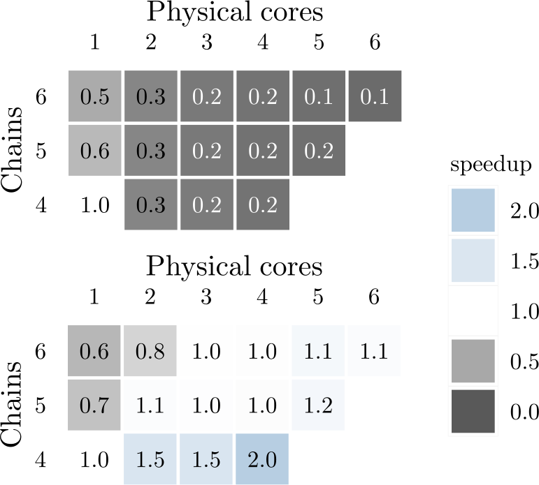

# Adaptive MCMC Parallelisation in Stan

 

Dynamic determination of optimum chains and cores for MCMC in R / Stan.

---

<figure>
  
  <figcaption>Figure 1. MCMC parallelisation  and Stan model inference speedup. Simple model (top) vs complex model (bottom). Adapted from [<a href="#references">1</a>].</figcaption>
</figure>

---

## Table of Contents

- [Key Files](#key-files)
- [Software Requirements](#software-requirements)
- [Quality Assurance](#quality-assurance)
- [Getting Started](#getting-started)
- [Acknowledgements](#acknowledgements)
- [References](#references)

## Key Files

| File                                       | Notes     |
| :----------------------------------------- | :-------- |
| `src/adaptive-mcmc-parallelisation-stan.R` | R script. |

## Software Requirements

| Software          | Notes                                                                                                                               |
| :---------------- | :---------------------------------------------------------------------------------------------------------------------------------- |
| R &nbsp;       | [Available here](https://www.r-project.org/). Free. &nbsp;&nbsp;&nbsp;Version 4.6.x required.                                    |
| RStudio &nbsp; | [Details here](https://posit.co/products/open-source/rstudio). Optional. &nbsp;&nbsp;&nbsp;Free and fee-based options available. |

### R Configuration

Please ensure the R environment has the following packages installed.

- microbenchmark
- rstan
- rstudioapi

Please ensure their dependencies are also installed.

Dependencies

- BH
- abind
- backports
- callr
- checkmate
- cpp11
- desc
- distributional
- farver
- generics
- ggplot2
- gridExtra
- gtable
- inline
- isoband
- labeling
- loo
- matrixStats
- numDeriv
- otel
- pillar
- pkgbuild
- pkgconfig
- posterior
- processx
- ps
- QuickJSR
- R6
- RColorBrewer
- Rcpp
- RcppEigen
- RcppParallel
- S7
- scales
- StanHeaders
- tensorA
- tibble
- utf8
- viridisLite
- withr

## Quality Assurance

The R script has been tested in the following environment.

Windows Test Environment

 

| Type      | Component        | Version                                |
| :-------- | :--------------- | :------------------------------------- |
| Platform  | Operating system | Windows 11, 25H2 (OS Build 26200.9278) |
| Software  | R                | 4.6.1                                  |
| &quot;    | RStudio          | 2026.08.2 (Build 200)                  |
| R package | BH               | 1.90.0-1                               |
| &quot;    | abind            | 1.4-8                                  |
| &quot;    | backports        | 1.5.1                                  |
| &quot;    | callr            | 3.8.0                                  |
| &quot;    | checkmate        | 2.3.4                                  |
| &quot;    | cpp11            | 0.5.5                                  |
| &quot;    | desc             | 1.4.3                                  |
| &quot;    | distributional   | 0.8.1                                  |
| &quot;    | farver           | 2.1.2                                  |
| &quot;    | generics         | 0.1.4                                  |
| &quot;    | ggplot2          | 4.0.3                                  |
| &quot;    | gridExtra        | 2.3.1                                  |
| &quot;    | gtable           | 0.3.6                                  |
| &quot;    | inline           | 0.3.21                                 |
| &quot;    | isoband          | 0.3.0                                  |
| &quot;    | labeling         | 0.4.3                                  |
| &quot;    | loo              | 2.10.1                                 |
| &quot;    | matrixStats      | 1.5.0                                  |
| &quot;    | microbenchmark   | 1.5.0                                  |
| &quot;    | numDeriv         | 2016.8-1.1                             |
| &quot;    | otel             | 0.2.0                                  |
| &quot;    | pillar           | 1.11.1                                 |
| &quot;    | pkgbuild         | 1.4.8                                  |
| &quot;    | pkgconfig        | 2.0.3                                  |
| &quot;    | posterior        | 1.7.0                                  |
| &quot;    | processx         | 3.9.0                                  |
| &quot;    | ps               | 1.9.3                                  |
| &quot;    | QuickJSR         | 1.11.0                                 |
| &quot;    | R6               | 2.6.1                                  |
| &quot;    | RColorBrewer     | 1.1-3                                  |
| &quot;    | Rcpp             | 1.1.2                                  |
| &quot;    | RcppEigen        | 0.3.4.0.2                              |
| &quot;    | RcppParallel     | 6.2.1                                  |
| &quot;    | rstan            | 2.32.7                                 |
| &quot;    | rstudioapi       | 0.19.0                                 |
| &quot;    | S7               | 0.2.2                                  |
| &quot;    | scales           | 1.4.0                                  |
| &quot;    | StanHeaders      | 2.32.10                                |
| &quot;    | tensorA          | 0.36.2.1                               |
| &quot;    | tibble           | 3.3.1                                  |
| &quot;    | utf8             | 1.2.6                                  |
| &quot;    | viridisLite      | 0.4.3                                  |
| &quot;    | withr            | 3.0.3                                  |

## Getting Started

The file `adaptive-mcmc-parallelisation-stan.R` holds two functions
implementing adaptive parallelisation. That file should be run from R, or an
R-compatible IDE like RStudio.

## Acknowledgements

This work was supported by the Australian Research Council Training Centre in
Data Analytics for Resources and Environments (project ICI9010031) and
Australian National Health and Medical Research Council Ideas Grant
GNT1186572.

## References

1. T. N. Stenborg, 2023, "Adaptive MCMC Parallelisation in Stan", in _25th Int.
   Congr. Modelling Simulation_, J. Vaze, C. Chilcott, L. Hutley and S. M.
   Cuddy, Eds., 2023, p. 913, doi: 10.36334/modsim.2023.stenborg.\
   [View PDF](https://mssanz.org.au/modsim2023/files/stenborg.pdf)
   &nbsp; [View at publisher](https://mssanz.org.au/modsim2023/papersbysession.html)
   &nbsp; [SciX](https://scixplorer.org/abs/2023mdsm.conf..913S/abstract)
